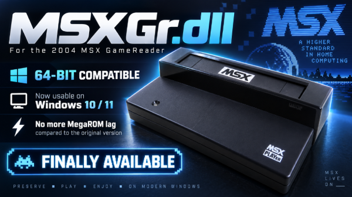

# MSXGr-WinUSB



An open-source replacement for `MSXGr.dll` for the **ASCII/Sunrise MSX Game
Reader** on Windows 10/11. The library communicates directly with Microsoft's
WinUSB driver. It does not require libusb, Python or Zadig after the initial
driver setup.

Keep the filename `MSXGr.dll`: compatible emulators load the library by this name.

## Downloads

- [v1.0.0.8 x64 package with documentation](https://github.com/Sebbeug/MSXGr-WinUSB/releases/download/v1.0.0.8/MSXGr-WinUSB-v1.0.0.8-x64.zip)
- [v1.0.0.8 x64 DLL only](https://github.com/Sebbeug/MSXGr-WinUSB/releases/download/v1.0.0.8/MSXGr.dll)
- [v1.0.0.8 prerelease notes](https://github.com/Sebbeug/MSXGr-WinUSB/releases/tag/v1.0.0.8)

**v1.0.0.8 is a prerelease; its cache is disabled by default.** Select a mapper
profile as described in [INSTALLATION.md](INSTALLATION.md) for emulator use.
The hardware-validated [v1.0.0.7 release](https://github.com/Sebbeug/MSXGr-WinUSB/releases/tag/v1.0.0.7)
remains available. Each release includes the DLL's SHA-256.

## Who needs the x64 version?

The x64 DLL is intended for **64-bit builds of
[blueMSX+](https://github.com/Hesoten/blueMSX-plus)** and other x64 applications
that support the MSXGr API. It cannot be loaded by the original 32-bit
MSXPLAYer or blueMSX. For those applications, keep the official x86 DLL if it
works, or build this project's x86 version.

## Installation

See [INSTALLATION.md](INSTALLATION.md). In short: install WinUSB once for
`VID 1125 / PID AC01`, then place `MSXGr.dll` **in the same folder as the
emulator executable**. Do not copy it to `System32`.

## Cartridges tested on real hardware

| Cartridge | Size | Mapper | Result |
|---|---:|---|---|
| The Goonies | 32 KiB | Konami | Working |
| Gradius / Nemesis | 128 KiB | Konami | Working, smooth gameplay |
| Nemesis 2 | 128 KiB | Konami SCC | Working, SCC audio with modified blueMSX+ |
| Space Manbow | 256 KiB | Konami SCC | Working, SCC audio with modified blueMSX+ |
| R-Type | 384 KiB | R-Type | Working |
| Rastan Saga | 256 KiB | ASCII8 | Working |
| Break In (1987) | 64 KiB | Mirrored | Working |
| Ghost (2017) | 32 KiB | Linear | Working |
| Super Mario World — Noramos (2021) | 2 MiB | Konami SCC | Working, user-tested |
| Aleste 2 — custom cartridge version | 2 MiB | ASCII16 | Working, user-tested |

These results apply to the cartridges tested with the v1.0.0.7 setup. They do
not establish general compatibility with modern flash, EEPROM or FPGA
cartridges, or cartridges with custom protection.

The DLL handles memory and I/O transfers; the emulator must use the cartridge's
actual mapper. For example, The Goonies requires **Konami**, despite its 32 KiB
size. SCC audio requires the modified blueMSX+ Game Reader integration: the
emulator synthesizes the sound, as the reader does not stream cartridge audio
over USB.

## Exported functions

The library preserves the original `__cdecl` ABI:

- `MSXGR_Init`, `MSXGR_Uninit`, `MSXGR_Err2Str`, `MSXGR_GetVersion`;
- `MSXGR_SetDebugMode`, `MSXGR_IsSlotEnable`, `MSXGR_GetSlotStatus`;
- `MSXGR_ReadMemory`, `MSXGR_WriteMemory`, `MSXGR_ReadIO`, `MSXGR_WriteIO`.

v1.0.0.8 adds `MSXGR_ReadMemoryDirect` (physical reads without prefetch) and
`MSXGR_SetCacheProfile` (explicit mapper profile). See [src/msxgr.h](src/msxgr.h).

It uses SetupAPI and WinUSB, opens one reader at the logical ID selected by
DIP switches 1–3, and offers an optional MegaROM cache with 8 KiB pages.
Memory and I/O writes are always forwarded to the hardware. v1.0.0.8 accepts
PID AC01 and AC02; AC02 has only been tested in simulation. Simultaneous
access to multiple readers is not supported.

## Building

Download [LLVM-MinGW](https://github.com/mstorsjo/llvm-mingw/releases), then
pass the extracted toolchain folder to the script. It builds both x64 and x86:

```powershell
powershell -NoProfile -ExecutionPolicy Bypass -File .\build.ps1 `
  -ToolchainPath C:\Tools\llvm-mingw
```

If the LLVM-MinGW compilers are already in `PATH`, omit `-ToolchainPath`.

Output files:

- `build/x64/MSXGr.dll`;
- `build/x86/MSXGr.dll`.

Run `.\test-cache.ps1` for the x86/x64 regression tests; they simulate USB and
do not access physical hardware.

The hardware test requires an **original 128 KiB Gradius/Nemesis cartridge**.
Close the emulator before running it:

```powershell
powershell -NoProfile -ExecutionPolicy Bypass -File .\test-gradius.ps1
```

The test checks the 128 KiB dump against the reference CRC32 `4dfcc009`.
A fresh build is not considered validated until both this test and an
in-emulator game test pass.

## Validated x64 release

SHA-256 of the v1.0.0.7 x64 `MSXGr.dll`:

```text
DD23AFDE25ACD004EF895A6F216C23EF6F67E5B8ACA549C5B5BCEE636444204F
```

Commercial ROMs, portable emulator builds, logs, dumps and unvalidated
prototypes are not included in this repository.

## License

`MSXGr-WinUSB` is released under the [MIT license](LICENSE).
[blueMSX+](https://github.com/Hesoten/blueMSX-plus) is a separate GPLv2 project;
its modifications are not included in this repository.
